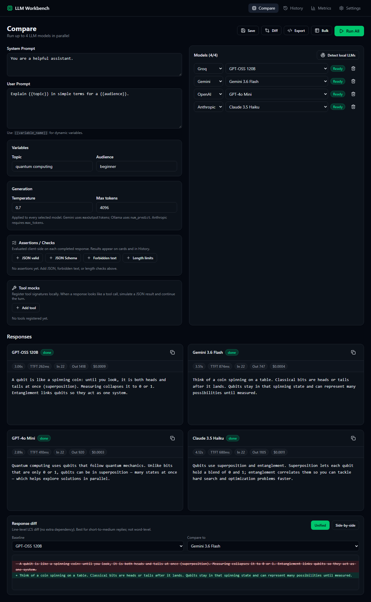
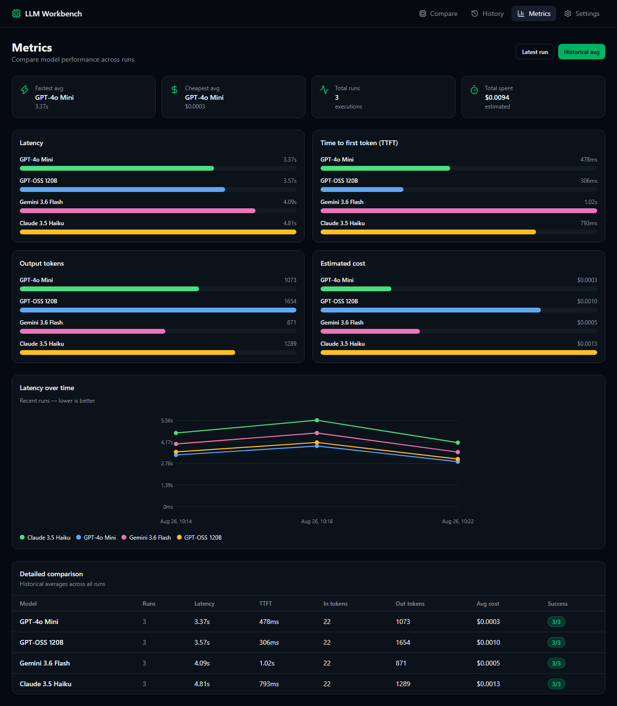
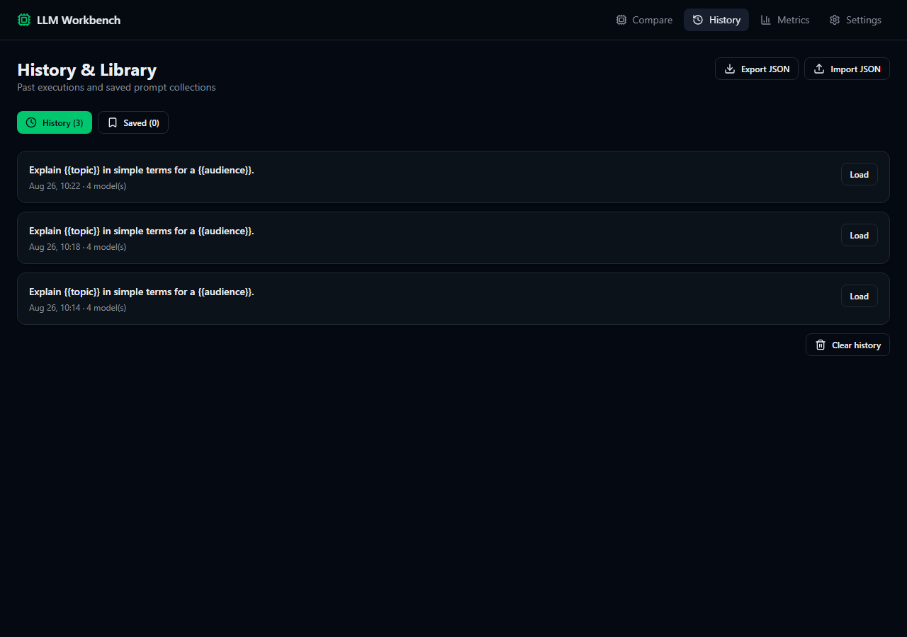
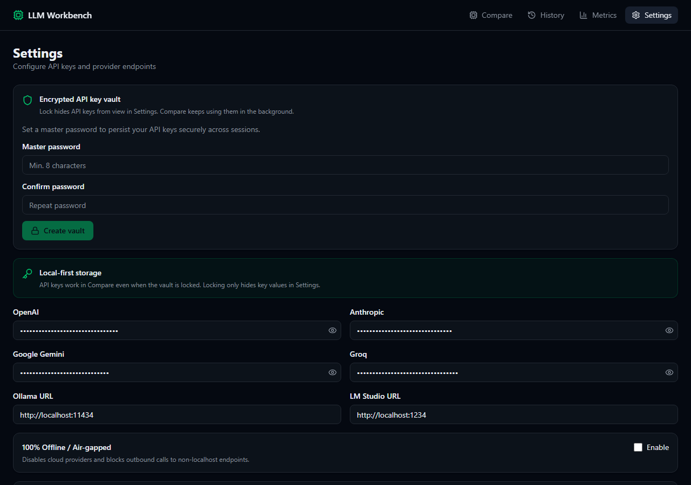

# LLM Playground OS

[](LICENSE)
[](https://github.com/ale94lko/repo-health-score)
[](https://nuxt.com)
[](https://vuejs.org)

Source-available **multi-LLM playground** for developers and AI enthusiasts. Design prompts with dynamic variables, run them in parallel against up to 4 models, and compare responses with real-time metrics — all **local-first** in your browser.

**Live demo:** [https://ale94lko.github.io/llm-playground-os/](https://ale94lko.github.io/llm-playground-os/)

## Screenshots

### Playground — compare models in parallel



Write system and user prompts with `{{variables}}`, pick up to 4 providers, and run them side-by-side.

### Metrics — charts and detailed comparison



Track latency, TTFT, tokens, and cost. Toggle between **Latest run** and **Historical avg**, with a latency timeline across executions.

### History — past runs and saved prompts



Browse previous comparisons and reload any run back into the playground.

### Settings — encrypted vault and API keys



Store API keys locally with AES-256-GCM encryption and an optional master password vault.

## Features

- **Multi-provider support** — OpenAI, Anthropic, Google Gemini, Groq, and local Ollama
- **Parallel execution** — Compare up to 4 models side-by-side in a responsive grid
- **Variable engine** — Use `{{variable_name}}` syntax with auto-generated input fields
- **Real-time metrics** — Latency, TTFT, token counts, and estimated cost per model
- **Metrics dashboard** — Bar charts, latency timeline, and detailed comparison table
- **Local-first API keys** — Encrypted with AES-256-GCM + master password before localStorage
- **Code exporter** — Generate snippets for JavaScript, Python, cURL, and PHP
- **History & library** — Save prompts with versioning and browse past executions
- **Mobile-friendly** — Hamburger navigation menu on small screens

## Quick Start

```bash
git clone https://github.com/ale94lko/llm-playground-os.git
cd llm-playground-os
cp .env.example .env
npm install
npm run dev
```

Open [http://localhost:3000](http://localhost:3000).

`.env.example` documents the supported variables:

| Variable | Default | Purpose |
| :--- | :--- | :--- |
| `NUXT_APP_BASE_URL` | `/` | Public path prefix. GitHub Pages uses `/llm-playground-os/`. |
| `NUXT_DEVTOOLS` | `false` | Enable Nuxt DevTools. Set `true` locally if you want the overlay. |
| `OPENAI_API_KEY` | _(empty)_ | Optional. Used by exporter snippets / local tooling. Get a key at [platform.openai.com](https://platform.openai.com/api-keys). |
| `ANTHROPIC_API_KEY` | _(empty)_ | Optional. Same as above for Anthropic ([console.anthropic.com](https://console.anthropic.com/settings/keys)). |
| `GEMINI_API_KEY` | _(empty)_ | Optional. Same as above for Google Gemini ([aistudio.google.com](https://aistudio.google.com/apikey)). |
| `GROQ_API_KEY` | _(empty)_ | Optional. Same as above for Groq ([console.groq.com](https://console.groq.com/keys)). |

The browser **Settings vault** is the primary place for API keys. Leave the provider env vars empty for a normal local run; `npm run dev` does not require them.
### Docker (one command)

```bash
docker compose up --build
```

The production server listens on [http://localhost:3000](http://localhost:3000) and exposes:

- `GET /api/health` — liveness
- `GET /api/metrics` — process uptime and stream counters
- `POST /api/stream` — LLM stream proxy (no CORS)

Optional local Ollama:

```bash
docker compose --profile ollama up --build
```

### Configure providers

1. Go to **Settings** and create an encrypted vault with a master password
2. Unlock the vault and add your API keys (or Ollama URL for local models)
3. Select models in the **Playground**
4. Write your prompt with optional `{{variables}}`
5. Click **Run All**

> **Ollama tip:** Install [Ollama](https://ollama.com) and run `ollama pull llama3.2` — no API key needed. For browser access, set `OLLAMA_ORIGINS=*` if required.

## Streaming architecture

The app is a **static SPA** (`ssr: false`) designed to run on GitHub Pages without a backend.

| Environment | How streaming works |
| :--- | :--- |
| **Production** (GitHub Pages) | Calls LLM provider APIs **directly from the browser** |
| **Local dev** (`npm run dev`) | Uses the Nitro proxy at `/api/stream` (all providers, no CORS issues) |
| **Custom proxy** (optional) | Set **Stream proxy URL** in Settings to forward requests to your own server |

### Provider notes for browser deployment

| Provider | Browser support |
| :--- | :--- |
| **Groq** | Works out of the box |
| **Gemini** | Works — restrict your API key by HTTP referrer (e.g. `https://ale94lko.github.io/*`) in [Google AI Studio](https://aistudio.google.com/apikey) |
| **Anthropic** | Works with direct browser access header |
| **OpenAI** | May be blocked by CORS — use local dev, Groq/Gemini, or a stream proxy |
| **Ollama** | Local only — requires a running Ollama instance on your machine |

## Deploy

### GitHub Pages (recommended)

The repo includes a GitHub Actions workflow that builds and deploys automatically on every push to `main`.

1. Go to **Settings → Pages → Build and deployment**
2. Set **Source** to **GitHub Actions**
3. Push to `main` — the workflow `.github/workflows/deploy-pages.yml` handles the rest

The site is published at:

```text
https://<username>.github.io/<repo-name>/
```

For this repo: [https://ale94lko.github.io/llm-playground-os/](https://ale94lko.github.io/llm-playground-os/)

Build locally:

```bash
NUXT_APP_BASE_URL=/llm-playground-os/ npm run generate
npx serve .output/public
```

### Vercel / Node hosting

For full provider support including OpenAI without CORS limitations, deploy to a platform with a Node server (Vercel, Netlify, etc.) so `/api/stream` is available:

[](https://vercel.com/new/clone?repository-url=https://github.com/ale94lko/llm-playground-os)

```bash
npm run build
```

## Tech Stack

| Layer | Technology |
| :--- | :--- |
| Framework | Nuxt 4 (Vue 3 Composition API, SPA mode) |
| Styling | Tailwind CSS v4 |
| State | Pinia + pinia-plugin-persistedstate |
| Icons | Lucide Vue |
| Streaming | Browser-direct (prod) + Nitro proxy (dev) |
| Tests | Vitest + coverage (`@vitest/coverage-v8`) |
| Lint | ESLint via `@nuxt/eslint` |
| Observability | Structured JSON logs, `/api/health`, `/api/metrics` |

## Project Structure

```text
app/
├── components/
│   ├── ui/              # Base UI components
│   ├── playground/      # Prompt editor, model selector, response cards
│   ├── metrics/         # Bar charts and latency timeline
│   ├── settings/        # API key manager, encrypted vault
│   └── layout/          # Header with desktop nav + mobile menu
├── composables/         # LLM streaming, cost calculator, code exporter
├── lib/                 # Crypto, errors, metrics, stream providers, provider models, logger, validation
├── pages/               # Playground, history, metrics, settings
├── stores/              # Provider & prompt state (persisted)
└── plugins/             # Vault bootstrap + client error tracking
server/api/              # Stream proxy, health, and metrics (local dev / Node / Docker)
docs/
└── screenshots/         # README example images
```

## Development

```bash
cp .env.example .env
npm run dev          # Start dev server (uses /api/stream proxy)
npm run build        # Production build (Node server)
npm run generate     # Static export for GitHub Pages
npm run lint         # ESLint
npm run typecheck    # vue-tsc via Nuxt
npm test             # Run unit tests
npm run test:coverage
npm run test:watch   # Watch mode
docker compose up --build
```

## Security

API keys are encrypted client-side using **AES-256-GCM** with a key derived from your master password (PBKDF2, 100k iterations). Only the encrypted payload is persisted in localStorage.

Keys also live in sessionStorage for the current browser session. Locking the vault **only hides key values in Settings** — the playground keeps working with keys already loaded in memory.

> **Note:** In production (GitHub Pages), API keys are sent directly from your browser to the LLM provider. This is intentional for a local-first playground, but never share your machine or browser session with untrusted parties.

The **code exporter** never embeds stored API keys. Generated JavaScript, Python, cURL, and PHP snippets always read credentials from the environment (`process.env.OPENAI_API_KEY`, `os.environ['OPENAI_API_KEY']`, `$OPENAI_API_KEY`, `getenv('OPENAI_API_KEY')`).

Client and stream failures use a typed `StreamError` (`app/lib/errors.ts`). Before anything is written by the structured logger (`app/lib/logger.ts`), sensitive fields (`apiKey`, `authorization`, `password`, `secret`, `token`, …) are redacted, and `StreamError.toLogFields()` only serializes safe summaries (never raw `cause` objects).

## Contributing

Contributions are welcome! Please read [CONTRIBUTING.md](CONTRIBUTING.md) and open an issue first to discuss what you'd like to change.

1. Fork the repo
2. Create a feature branch (`git checkout -b feature/amazing-feature`)
3. Run `npm run lint`, `npm run typecheck`, and `npm test`
4. Commit your changes in small, focused commits (tests with the feature)
5. Push and open a Pull Request

## License

**llm-playground-os** is source-available under the terms in [`LICENSE`](LICENSE): use, modification, and distribution are allowed, but using this software or its documentation to train, fine-tune, evaluate, or synthesize AI/ML/LLM systems requires a separate paid written agreement with the copyright holder.
